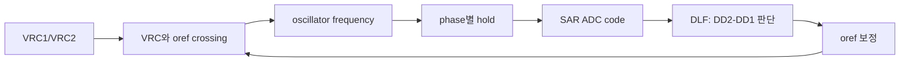
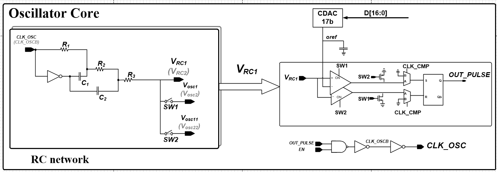
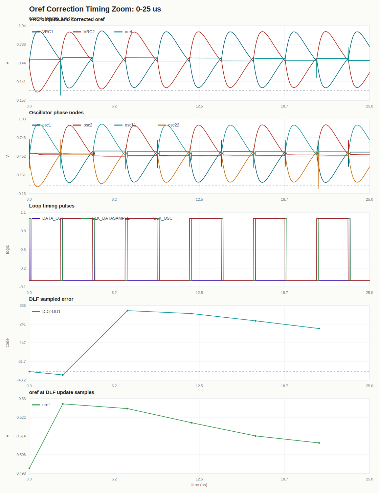
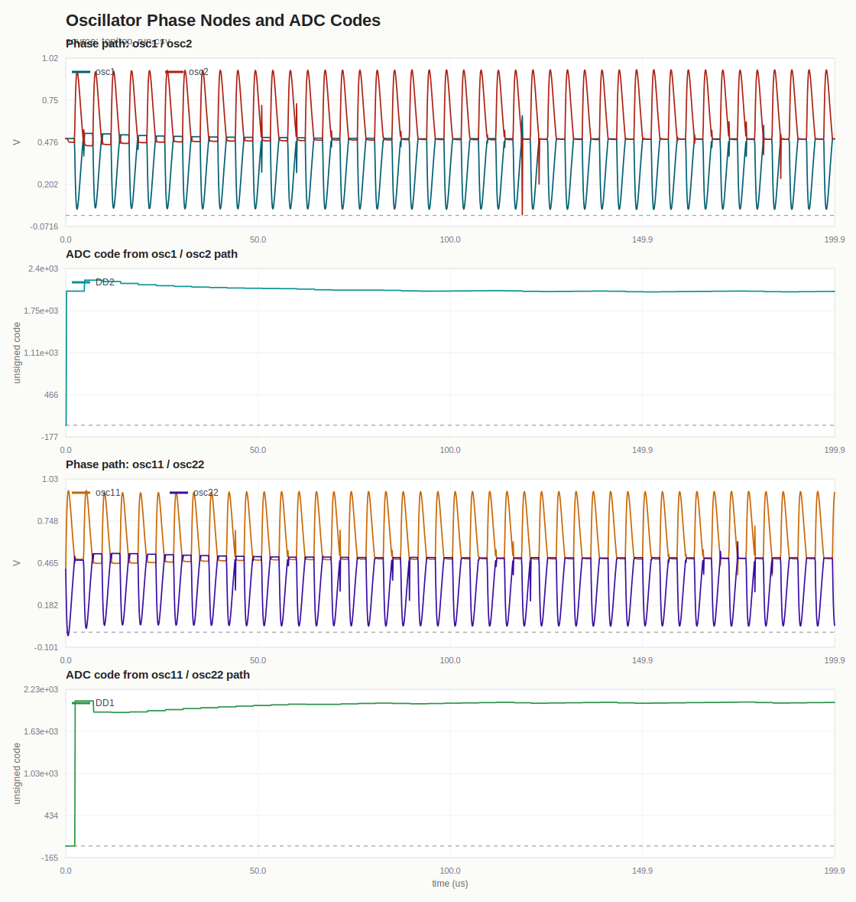

# RC Distributed Oscillator Verification

이 저장소는 **RC oscillator가 기준 전압 `oref`를 보정하면서 oscillator 주파수를 조절하는 과정**을 보여주는 검증 자료입니다. 회로 그림과 `top/top_run.csv` 기반 그래프를 함께 정리했습니다.

## 먼저 보면 되는 것

- 전체 그림으로 보기: [docs/index.html](docs/index.html)
- 웹페이지로 보기: [https://qkfka781-wq.github.io/RCoscillator/](https://qkfka781-wq.github.io/RCoscillator/)
- top loop 설명: [docs/top_loop.md](docs/top_loop.md)

## 이 회로가 하는 일

두 phase에서 sample한 code 차이가 남아 있으면 DLF가 `oref`를 바꾸고, `oref`가 조정되면 `VRC`와 crossing timing이 바뀝니다. 그 결과 oscillator frequency와 다음 CP hold 값이 바뀌고, 이 과정이 반복되면서 error가 0으로 수렴합니다.



## 용어 빠른 설명

| 이름 | 의미 |
| --- | --- |
| `VRC1`, `VRC2` | distributed RC network의 출력 전압 |
| `oref` | `VRC1`과 비교되는 기준 전압 |
| `CP1`, `CP2` | 해당 phase에서 ADC되는 `VRC1-VRC2` hold 결과의 디지털 code |
| `DD1`, `DD2` | 두 phase의 sampled digital code |
| `DD2-DD1` | DLF가 줄이려는 phase code error |
| DLF | `DD2-DD1`을 보고 `oref` 보정 방향을 결정하는 digital loop filter |
| CDAC_17b | DLF code를 실제 `oref` 전압으로 바꾸는 DAC |

## 1. Oscillator Core

[](docs/assets/01_oscillator_core.png)

## 2. Sample/Hold And SAR ADC

[](docs/assets/02_sample_hold_sar.png)

## 3. CSV 그래프

[](docs/img/top_oref_timing_zoom.svg)

[](docs/img/top_phase_adc_paths.svg)

[](docs/img/top_lock_summary.svg)

[](docs/img/top_cp_hold_codes.svg)

## 블록별 검증 문서

| Block | Link |
| --- | --- |
| SAR integration | [sar_test/20260702_sar_integration_verify.md](sar_test/20260702_sar_integration_verify.md) |
| DLF | [dlf_test/20260702_dlf_verify.md](dlf_test/20260702_dlf_verify.md) |
| oref CDAC_17b | [cdac17_test/20260702_cdac17_verify.md](cdac17_test/20260702_cdac17_verify.md) |
| SAR CDAC_12b | [cdac_test/20260701_cdac_12b_verify.md](cdac_test/20260701_cdac_12b_verify.md) |
| StrongARM comparator | [strongarm_test/20260701_sar_comparator_verify.md](strongarm_test/20260701_sar_comparator_verify.md) |

## 숫자 자료

- [docs/top_run_summary.md](docs/top_run_summary.md)
- [docs/top_numeric_analysis.md](docs/top_numeric_analysis.md)
- [docs/top_event_analysis.csv](docs/top_event_analysis.csv)

`top/top_run.csv`를 다시 만들면 아래 명령으로 SVG 그래프를 재생성할 수 있습니다.

```powershell
python scripts/generate_top_graphs.py
```
