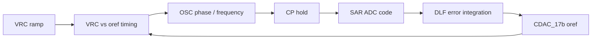

# RC Distributed Oscillator Verification

RC distributed oscillator의 top loop와 각 블록 검증 자료를 한곳에서 볼 수 있게 정리한 저장소입니다. 숫자표보다 회로도와 파형을 먼저 볼 수 있도록 GitHub Pages용 대시보드를 만들었습니다.

## 바로 보기

- Visual dashboard: [docs/index.html](docs/index.html)
- GitHub Pages: `https://qkfka781-wq.github.io/RCoscillator/`
- Top loop note: [docs/top_loop.md](docs/top_loop.md)

## 핵심 동작

`CP` hold 시점의 아날로그 값을 SAR ADC가 코드로 읽고, DLF가 `DD2-DD1` error를 적분합니다. 그 결과로 `oref`가 움직이고, `VRC`와 `oref`의 비교 타이밍이 바뀌면서 oscillator phase/frequency가 다시 바뀝니다. 이 피드백이 반복되어 최종적으로 `DD2-DD1 -> 0`에 가까워지는 구조입니다.



## 회로와 파형

아래 이미지는 클릭하면 크게 열립니다.

[](docs/assets/oscillator_core.png)

[](docs/assets/osc_to_sar_path.png)

[](docs/assets/phase_error_waveform.png)

## 생성 그래프

[](docs/img/top_lock_summary.svg)

[](docs/img/top_dlf_convergence.svg)

[](docs/img/top_cp_hold_codes.svg)

## 블록별 검증

| Block | Link |
| --- | --- |
| SAR integration | [sar_test/20260702_sar_integration_verify.md](sar_test/20260702_sar_integration_verify.md) |
| DLF | [dlf_test/20260702_dlf_verify.md](dlf_test/20260702_dlf_verify.md) |
| oref CDAC_17b | [cdac17_test/20260702_cdac17_verify.md](cdac17_test/20260702_cdac17_verify.md) |
| SAR CDAC_12b | [cdac_test/20260701_cdac_12b_verify.md](cdac_test/20260701_cdac_12b_verify.md) |
| StrongARM comparator | [strongarm_test/20260701_sar_comparator_verify.md](strongarm_test/20260701_sar_comparator_verify.md) |

## 데이터 자료

숫자 자료는 메인 화면에서는 뒤로 빼두었습니다. 필요할 때만 아래 파일을 보면 됩니다.

- [docs/top_run_summary.md](docs/top_run_summary.md)
- [docs/top_numeric_analysis.md](docs/top_numeric_analysis.md)
- [docs/top_event_analysis.csv](docs/top_event_analysis.csv)

`top/top_run.csv`를 다시 만들면 아래 명령으로 SVG 그래프를 재생성할 수 있습니다.

```powershell
python scripts/generate_top_graphs.py
```
