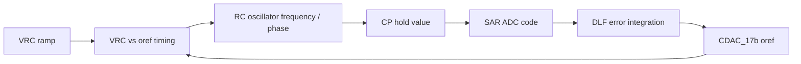

# RC Distributed Oscillator Verification

RC distributed oscillator의 블록별 검증 결과와 top-level 폐루프 동작을 정리한 저장소입니다.

## Dashboard

그래프와 블록 흐름을 한 화면에서 보려면 아래 HTML 대시보드를 여세요.

- GitHub 파일 보기: [docs/index.html](docs/index.html)
- GitHub Pages 사용 시: `https://qkfka781-wq.github.io/RCoscillator/`

## Core Loop

핵심 폐루프는 `CP` hold 시점의 아날로그 값을 SAR ADC로 읽고, DLF가 phase-code error를 적분해 `oref`를 조절하며, 바뀐 `oref`가 다시 `VRC` 비교 타이밍과 주파수를 바꾸는 구조입니다. 최종 lock 조건은 `DD2-DD1 -> 0`입니다.



## Quick Links

| Topic | Link |
|------|------|
| Visual dashboard | [docs/index.html](docs/index.html) |
| Top closed-loop explanation and plots | [docs/top_loop.md](docs/top_loop.md) |
| Generated top-run summary | [docs/top_run_summary.md](docs/top_run_summary.md) |
| Event analysis CSV | [docs/top_event_analysis.csv](docs/top_event_analysis.csv) |
| SAR integration verification | [sar_test/20260702_sar_integration_verify.md](sar_test/20260702_sar_integration_verify.md) |
| DLF verification | [dlf_test/20260702_dlf_verify.md](dlf_test/20260702_dlf_verify.md) |
| oref CDAC_17b verification | [cdac17_test/20260702_cdac17_verify.md](cdac17_test/20260702_cdac17_verify.md) |
| SAR CDAC_12b verification | [cdac_test/20260701_cdac_12b_verify.md](cdac_test/20260701_cdac_12b_verify.md) |
| StrongARM comparator verification | [strongarm_test/20260701_sar_comparator_verify.md](strongarm_test/20260701_sar_comparator_verify.md) |

## Main Graphs

Click each plot to open the full SVG.

[](docs/img/top_lock_summary.svg)

[](docs/img/top_loop_overview.svg)

[](docs/img/top_dlf_convergence.svg)

[](docs/img/top_cp_hold_codes.svg)

## Regenerate Plots

After updating `top/top_run.csv`, regenerate GitHub-renderable SVG plots with:

```powershell
python scripts/generate_top_graphs.py
```
