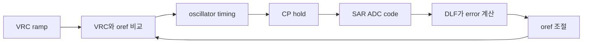

# RC Distributed Oscillator Verification

이 저장소는 **RC oscillator가 스스로 주파수와 phase를 맞추는 과정**을 보여주는 검증 자료입니다. 처음 보는 사람도 흐름을 잡을 수 있도록 회로도, 파형, 블록별 검증 문서를 한곳에 묶었습니다.

## 먼저 보면 되는 것

- 전체 그림으로 보기: [docs/index.html](docs/index.html)
- 웹페이지로 보기: [https://qkfka781-wq.github.io/RCoscillator/](https://qkfka781-wq.github.io/RCoscillator/)
- top loop 설명: [docs/top_loop.md](docs/top_loop.md)

## 이 회로가 하는 일

목표는 간단합니다.

**두 oscillator phase가 같은 지점에서 sample되도록 `oref`를 자동으로 조절하는 것**입니다.

회로는 매 cycle마다 다음 일을 반복합니다.

1. `VRC`라는 RC ramp 전압이 올라가거나 내려갑니다.
2. `VRC`가 기준 전압 `oref`와 만나는 순간이 oscillator timing을 만듭니다.
3. 그 timing에서 `CP` 전압을 hold합니다.
4. SAR ADC가 hold된 `CP` 전압을 digital code로 바꿉니다.
5. DLF가 두 phase의 code 차이인 `DD2-DD1`을 봅니다.
6. 차이가 남아 있으면 DLF가 `oref`를 조금 움직입니다.
7. `oref`가 바뀌면 다음 cycle의 timing과 frequency가 다시 바뀝니다.

최종적으로는 `DD2-DD1`이 0 근처가 되면 lock된 것으로 봅니다.



## 용어 빠른 설명

| 이름 | 의미 |
| --- | --- |
| `VRC` | RC oscillator 안에서 시간에 따라 변하는 ramp 전압 |
| `oref` | `VRC`와 비교되는 기준 전압. DLF가 이 값을 움직임 |
| `CP` | hold 순간에 잡히는 아날로그 전압 |
| SAR ADC | `CP` 아날로그 전압을 digital code로 변환하는 블록 |
| `DD1`, `DD2` | 두 phase에서 얻은 digital sample code |
| DLF | `DD2-DD1` error를 보고 `oref`를 조절하는 digital loop filter |
| CDAC_17b | DLF code를 실제 `oref` 전압으로 바꾸는 DAC |

## 회로와 파형

이미지를 클릭하면 크게 열립니다.

[](docs/assets/osc_to_sar_path.png)

[](docs/assets/oscillator_core.png)

[](docs/assets/phase_error_waveform.png)

## CSV에서 만든 확인 그래프

[](docs/img/top_lock_summary.svg)

[](docs/img/top_dlf_convergence.svg)

[](docs/img/top_cp_hold_codes.svg)

## 블록별 검증 문서

| Block | Link |
| --- | --- |
| SAR integration | [sar_test/20260702_sar_integration_verify.md](sar_test/20260702_sar_integration_verify.md) |
| DLF | [dlf_test/20260702_dlf_verify.md](dlf_test/20260702_dlf_verify.md) |
| oref CDAC_17b | [cdac17_test/20260702_cdac17_verify.md](cdac17_test/20260702_cdac17_verify.md) |
| SAR CDAC_12b | [cdac_test/20260701_cdac_12b_verify.md](cdac_test/20260701_cdac_12b_verify.md) |
| StrongARM comparator | [strongarm_test/20260701_sar_comparator_verify.md](strongarm_test/20260701_sar_comparator_verify.md) |

## 숫자 자료

숫자 자료는 보조 자료입니다. 필요할 때만 보면 됩니다.

- [docs/top_run_summary.md](docs/top_run_summary.md)
- [docs/top_numeric_analysis.md](docs/top_numeric_analysis.md)
- [docs/top_event_analysis.csv](docs/top_event_analysis.csv)

`top/top_run.csv`를 다시 만들면 아래 명령으로 SVG 그래프를 재생성할 수 있습니다.

```powershell
python scripts/generate_top_graphs.py
```
