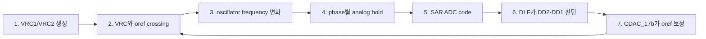
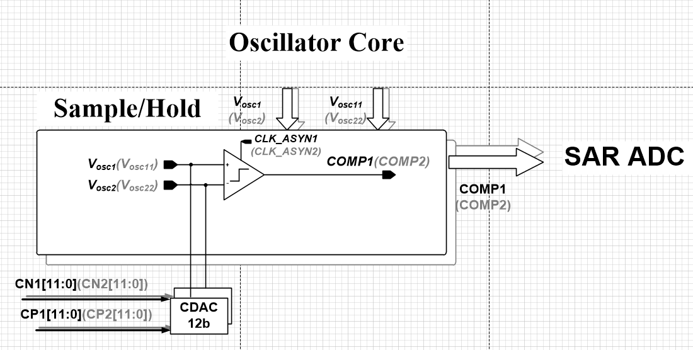
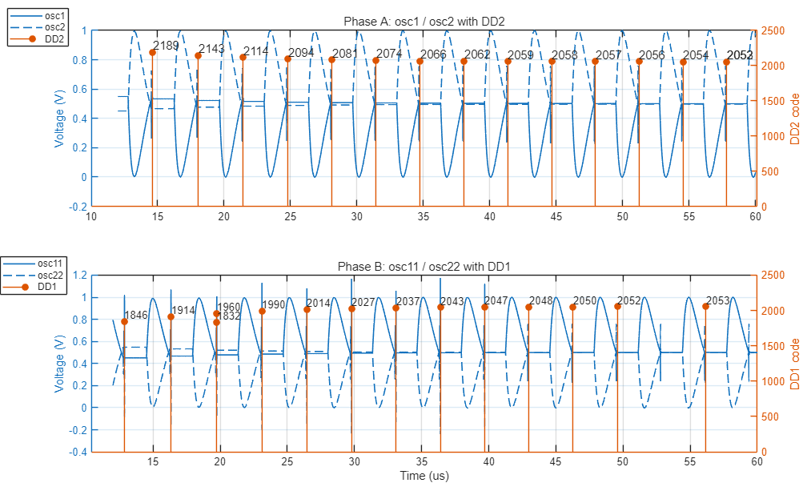

# Top Closed-Loop Operation

이 문서는 RC oscillator top loop를 처음 보는 사람도 이해할 수 있게 설명한 자료입니다.

**이 회로는 기준 전압 `oref`를 보정하며 oscillator 주파수를 조절하고, 두 phase의 sample code 차이가 0으로 수렴하도록 만듭니다.**

## 핵심 흐름

두 phase에서 sample한 code 차이가 남아 있으면 DLF가 `oref`를 바꾸고, `oref`가 조정되면 `VRC`와 crossing timing이 바뀝니다. 그 결과 oscillator frequency와 다음 CP hold 값이 바뀌고, 이 과정이 반복되면서 error가 0으로 수렴합니다.

## 신호 이름부터 보기

| 이름 | 쉽게 말하면 | 회로에서 하는 일 |
| --- | --- | --- |
| `VRC1`, `VRC2` | distributed RC network의 출력 전압 | oscillator core에서 비교 timing을 만드는 아날로그 출력 |
| `oref` | `VRC1`과 비교되는 기준 전압 | DLF/CDAC_17b에 의해 보정되며 crossing timing을 바꿈 |
| `osc1`, `osc2` | 한 phase의 oscillator node | 이 path의 결과가 `DD2` code로 이어짐 |
| `osc11`, `osc22` | 다른 phase의 oscillator node | 이 path의 결과가 `DD1` code로 이어짐 |
| `CP1`, `CP2` | phase별 ADC hold 결과의 디지털 code | 해당 phase에서 ADC되는 `VRC1-VRC2` hold 결과 |
| `DD1`, `DD2` | 두 phase의 sampled digital code | DLF가 비교하는 code |
| `DD2-DD1` | error | 0으로 수렴해야 하는 값 |
| DLF | digital loop filter | error를 보고 `oref` 보정 방향을 결정 |
| CDAC_17b | oref DAC | DLF code를 실제 `oref` 전압으로 변환 |

## 단계별 동작

1. distributed RC network에서 `VRC1`, `VRC2`가 나옵니다.
2. oscillator core에서 `VRC`와 `oref`의 crossing timing이 정해집니다.
3. crossing timing이 바뀌면 oscillator frequency가 바뀝니다.
4. 그 timing에서 아날로그 전압을 hold합니다.
5. SAR ADC가 phase별 hold 결과를 digital code로 만듭니다.
6. DLF가 `DD2-DD1`을 보고 error가 남았는지 판단합니다.
7. error가 있으면 CDAC_17b를 통해 `oref`를 보정합니다.
8. 보정된 `oref`가 다음 crossing timing을 바꾸고, 다시 frequency와 CP hold 값이 바뀝니다.

## 그림으로 보기

### 1. Oscillator Core

먼저 볼 그림입니다. Core 안에서는 `VRC`와 `oref`가 만나는 시간이 oscillator phase와 frequency를 결정합니다.

### 2. Sample/Hold와 SAR ADC 연결

그다음 볼 그림입니다. Oscillator core의 결과가 Sample/Hold를 거쳐 SAR ADC로 들어갑니다. 여기서 phase별 hold 결과가 digital code로 바뀌고, DLF 판단의 입력이 됩니다.

### 3. Phase와 oref가 같이 움직이는 파형

이 파형에서는 phase A/B, DD code, `oref`가 한꺼번에 보입니다. 봐야 할 점은 `oref`가 고정값이 아니라 error에 따라 보정되는 제어 전압이라는 것입니다.

## CSV에서 만든 확인 그래프

아래 그래프들은 `top/top_run.csv`에서 다시 추출한 결과입니다. 숫자를 외울 필요는 없고, 어떤 node와 어떤 code가 연결되는지 보면 됩니다.

### Oscillator Phase Nodes And ADC Codes

사용자 CSV에서 `osc1`, `osc2`, `DD2`와 `osc11`, `osc22`, `DD1`을 함께 그린 그래프입니다. 전압 node와 그 결과로 이어지는 digital code를 phase별로 나눠 봅니다.

### Error Convergence

`DD2-DD1` error가 0으로 수렴하는지 확인하는 요약 그래프입니다.

### CP Hold Codes

`DATA_OUT` edge에서 `CP1`, `CP2`가 어떤 digital code로 잡히는지 보여줍니다.

### DLF Convergence

DLF가 error를 보고 `oref`를 보정하면서 error가 줄어드는지 확인하는 그래프입니다.

## 블록별 역할

| Block | 역할 | 검증 문서 |
| --- | --- | --- |
| RC oscillator top | `VRC`/`oref` crossing, phase/frequency 생성, CP hold 연결 | `top/` |
| SAR ADC | phase별 hold 결과를 12-bit digital code로 변환 | [SAR verify](https://github.com/qkfka781-wq/RCoscillator/blob/main/sar_test/20260702_sar_integration_verify.md) |
| DLF | `DD2-DD1` error를 적분해 oref 보정 방향 결정 | [DLF verify](https://github.com/qkfka781-wq/RCoscillator/blob/main/dlf_test/20260702_dlf_verify.md) |
| CDAC_17b | DLF code를 `oref` 전압으로 변환 | [CDAC_17b verify](https://github.com/qkfka781-wq/RCoscillator/blob/main/cdac17_test/20260702_cdac17_verify.md) |
| CDAC_12b | SAR 내부 capacitive DAC | [CDAC_12b verify](https://github.com/qkfka781-wq/RCoscillator/blob/main/cdac_test/20260701_cdac_12b_verify.md) |
| StrongARM | SAR bit decision comparator | [StrongARM verify](https://github.com/qkfka781-wq/RCoscillator/blob/main/strongarm_test/20260701_sar_comparator_verify.md) |

## 마지막으로 기억할 것

- `oref`는 `VRC1`과 비교되는 기준 전압이며, DLF가 보정합니다.
- `oref`가 바뀌면 `VRC` crossing timing이 바뀝니다.
- crossing timing이 바뀌면 oscillator frequency가 바뀝니다.
- phase별 hold 결과는 SAR ADC를 거쳐 digital code가 됩니다.
- DLF는 `DD2-DD1`이 0으로 수렴하도록 `oref`를 계속 보정합니다.

## 숫자 자료

숫자 분석이 필요할 때만 아래 파일을 보면 됩니다.

- [top_run_summary.md](top_run_summary.md)
- [top_numeric_analysis.md](top_numeric_analysis.md)
- [top_event_analysis.csv](top_event_analysis.csv)

해석 기준은 `CP`, `DD`, `D` 계열은 unsigned code, `DIFF` 계열은 signed two's-complement입니다.
