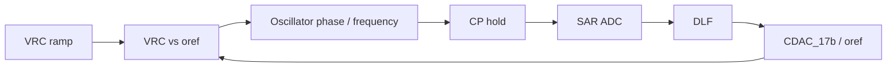
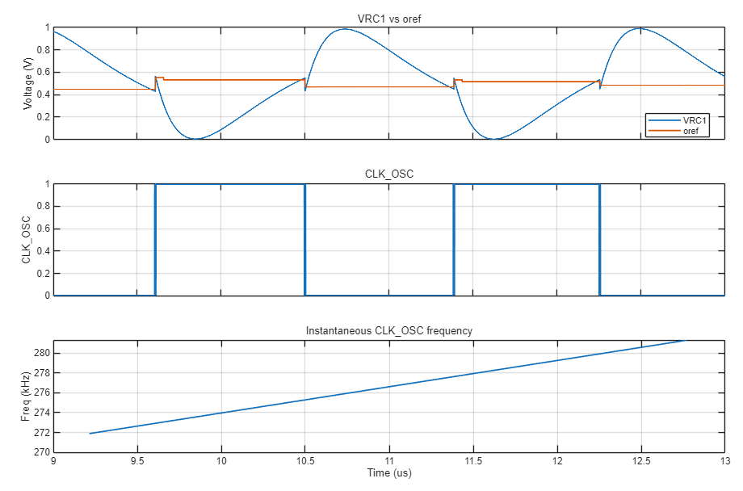
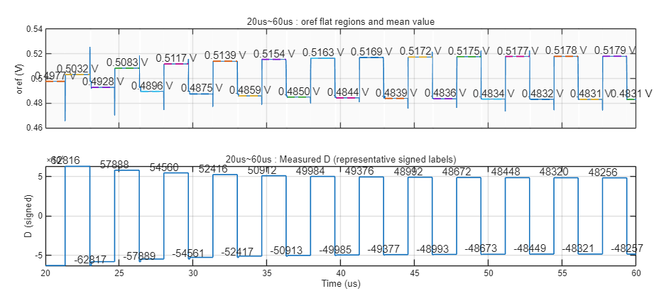

# Top Closed-Loop Operation

이 문서는 `top/RCnetlist`와 `top/top_run.csv`를 기준으로 RC oscillator top loop가 어떤 식으로 닫히는지 정리한 자료입니다. 숫자 자체보다 “어떤 신호가 다음 신호를 움직이는가”에 초점을 둡니다.

## 한 줄 요약

`CP` hold 값을 SAR ADC가 읽고, DLF가 `DD2-DD1` error를 줄이는 방향으로 `oref`를 조절합니다. `oref`가 바뀌면 `VRC` 비교 타이밍과 oscillator phase/frequency가 바뀌고, 다음 hold 시점의 CP 값도 다시 달라집니다.

## 회로 그림

### Oscillator, Sample/Hold, SAR ADC

이 그림은 top loop에서 가장 중요한 신호 경로입니다. Oscillator core의 VRC/oref 비교 결과가 phase를 만들고, CP hold 경로를 통해 SAR ADC 입력으로 넘어갑니다.

### Oscillator Core

core 안에서는 `VRC` ramp와 `oref` 기준 전압의 crossing 시점이 oscillator timing을 결정합니다.

## 파형 그림

### Timing And Frequency

`oref` 위치가 바뀌면 `VRC` crossing 시점이 달라지고, 그 결과 `CLK_OSC` timing과 instantaneous frequency도 같이 움직입니다.

### DLF Sample Path

DLF는 두 phase path의 sample 차이를 보고 누적 방향을 결정합니다. 여기서 중요한 것은 숫자 하나하나보다, error가 `oref`를 움직이는 방향성을 만든다는 점입니다.

## CSV에서 만든 그래프

아래 SVG는 `top/top_run.csv`에서 edge 기준으로 다시 뽑은 그래프입니다. GitHub에서 바로 보이고, 클릭하면 원본 크기로 열립니다.

### Lock Summary

loop가 진행되면서 DLF error가 0 근처로 들어오는 흐름을 보는 요약 그래프입니다.

### CP Hold Codes

`DATA_OUT` edge 기준으로 `CP1`, `CP2` hold code를 복원한 그래프입니다.

### DLF Convergence

`CLK_DATASAMPLE` 이후 안정된 시점에서 DLF 관련 값을 샘플링한 그래프입니다.

## 블록 역할

| Block | Role | Link |
| --- | --- | --- |
| RC oscillator top | VRC/oref 비교, phase/frequency 생성, CP hold 연결 | `top/` |
| SAR ADC | hold된 CP 아날로그 값을 12-bit code로 변환 | [SAR verify](https://github.com/qkfka781-wq/RCoscillator/blob/main/sar_test/20260702_sar_integration_verify.md) |
| DLF | `DD2-DD1` error를 적분해 oref 방향 결정 | [DLF verify](https://github.com/qkfka781-wq/RCoscillator/blob/main/dlf_test/20260702_dlf_verify.md) |
| CDAC_17b | DLF code를 `oref` 전압으로 변환 | [CDAC_17b verify](https://github.com/qkfka781-wq/RCoscillator/blob/main/cdac17_test/20260702_cdac17_verify.md) |
| CDAC_12b | SAR 내부 capacitive DAC | [CDAC_12b verify](https://github.com/qkfka781-wq/RCoscillator/blob/main/cdac_test/20260701_cdac_12b_verify.md) |
| StrongARM | SAR bit decision comparator | [StrongARM verify](https://github.com/qkfka781-wq/RCoscillator/blob/main/strongarm_test/20260701_sar_comparator_verify.md) |

## 숫자 자료

숫자 분석이 필요할 때만 아래 파일을 보면 됩니다.

- [top_run_summary.md](top_run_summary.md)
- [top_numeric_analysis.md](top_numeric_analysis.md)
- [top_event_analysis.csv](top_event_analysis.csv)

해석 기준은 단순합니다. `CP`, `DD`, `D` 계열은 unsigned code로 보고, `DIFF` 계열은 signed two's-complement로 봅니다.
