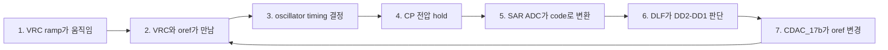

# Top Closed-Loop Operation

이 문서는 RC oscillator top loop를 처음 보는 사람도 이해할 수 있게 설명한 자료입니다. 핵심은 하나입니다.

**이 회로는 두 phase의 sample 차이 `DD2-DD1`이 0이 되도록 `oref`를 자동으로 조절합니다.**

## 왜 피드백이 필요한가

RC oscillator는 `VRC`라는 ramp 전압과 기준 전압 `oref`가 만나는 순간을 이용해 timing을 만듭니다. 그런데 공정, 전압, 온도, 초기 조건 때문에 두 phase가 정확히 같은 위치에서 sample되지 않을 수 있습니다.

그래서 회로는 매번 sample 결과를 보고 “한쪽이 빠른가, 느린가”를 판단합니다. 차이가 있으면 `oref`를 조금 움직이고, 다음 cycle에서 다시 확인합니다. 이 과정을 반복하면 두 phase의 차이가 줄어들고 oscillator가 원하는 지점에 lock됩니다.

## 신호 이름부터 보기

| 이름 | 쉽게 말하면 | 회로에서 하는 일 |
| --- | --- | --- |
| `VRC` | RC ramp 전압 | 시간에 따라 변하면서 비교 기준이 됨 |
| `oref` | 기준 전압 | `VRC`와 만나는 순간을 결정함 |
| `CP` | hold된 아날로그 값 | timing 결과를 아날로그 값으로 담고 있음 |
| SAR ADC | 아날로그-디지털 변환기 | `CP`를 digital code로 바꿈 |
| `DD1`, `DD2` | 두 phase의 sample code | phase 차이를 비교하는 재료 |
| `DD2-DD1` | error | 0이면 두 phase가 맞았다는 뜻 |
| DLF | digital loop filter | error를 누적해 `oref` 조절 방향을 결정 |
| CDAC_17b | oref DAC | DLF code를 실제 `oref` 전압으로 변환 |

## 전체 동작

단계별로 풀어 쓰면 이렇습니다.

1. `VRC`가 시간에 따라 ramp 형태로 변합니다.
2. `VRC`가 `oref`와 만나는 시점이 oscillator의 timing을 정합니다.
3. 그 timing에 의해 `CP` 전압이 hold됩니다.
4. SAR ADC가 hold된 `CP` 전압을 digital code로 바꿉니다.
5. 두 phase에서 얻은 code `DD1`, `DD2`를 비교합니다.
6. DLF가 `DD2-DD1`을 보고 error가 남았는지 판단합니다.
7. error가 있으면 CDAC_17b를 통해 `oref`가 바뀝니다.
8. 바뀐 `oref`는 다음 `VRC` crossing 시점을 바꾸고, 다시 oscillator timing을 바꿉니다.

## 그림으로 보기

### 1. Top 신호 경로

이 그림은 전체 흐름을 가장 잘 보여줍니다. 왼쪽 oscillator core에서 만들어진 신호가 Sample/Hold를 지나 SAR ADC로 들어갑니다. 여기서 “아날로그 timing 결과가 digital code로 바뀐다”는 점이 중요합니다.

### 2. Oscillator Core

core 안에서는 `VRC`와 `oref`의 crossing 시점이 oscillator phase를 만듭니다. 따라서 `oref`를 움직이면 crossing 시점이 바뀌고, 결국 frequency와 phase도 바뀝니다.

### 3. Phase와 oref가 같이 움직이는 파형

이 파형에서는 phase A/B, DD code, `oref`가 한꺼번에 보입니다. 봐야 할 점은 `oref`가 고정값이 아니라 loop가 움직이는 제어 전압이라는 것입니다.

## CSV에서 만든 확인 그래프

아래 그래프들은 `top/top_run.csv`에서 edge 기준으로 다시 추출한 결과입니다. 숫자를 외울 필요는 없고, error가 줄어드는 방향만 보면 됩니다.

### Lock Summary

가장 중요한 그래프입니다. loop가 진행될수록 DLF error가 0 근처로 들어오는지 확인합니다.

### CP Hold Codes

`DATA_OUT` edge에서 `CP1`, `CP2`가 어떤 code로 잡히는지 보여줍니다. 이 값들이 SAR ADC를 거쳐 DLF 판단의 재료가 됩니다.

### DLF Convergence

DLF가 error를 보고 `oref`를 조절하면서 error가 줄어드는지 확인하는 그래프입니다.

## 블록별 역할

| Block | 역할 | 검증 문서 |
| --- | --- | --- |
| RC oscillator top | `VRC`/`oref` 비교, phase/frequency 생성, CP hold 연결 | `top/` |
| SAR ADC | hold된 CP 아날로그 값을 12-bit code로 변환 | [SAR verify](https://github.com/qkfka781-wq/RCoscillator/blob/main/sar_test/20260702_sar_integration_verify.md) |
| DLF | `DD2-DD1` error를 적분해 oref 방향 결정 | [DLF verify](https://github.com/qkfka781-wq/RCoscillator/blob/main/dlf_test/20260702_dlf_verify.md) |
| CDAC_17b | DLF code를 `oref` 전압으로 변환 | [CDAC_17b verify](https://github.com/qkfka781-wq/RCoscillator/blob/main/cdac17_test/20260702_cdac17_verify.md) |
| CDAC_12b | SAR 내부 capacitive DAC | [CDAC_12b verify](https://github.com/qkfka781-wq/RCoscillator/blob/main/cdac_test/20260701_cdac_12b_verify.md) |
| StrongARM | SAR bit decision comparator | [StrongARM verify](https://github.com/qkfka781-wq/RCoscillator/blob/main/strongarm_test/20260701_sar_comparator_verify.md) |

## 마지막으로 기억할 것

- `oref`는 고정 reference가 아니라 loop가 움직이는 제어 전압입니다.
- `VRC`와 `oref`의 crossing 시점이 oscillator timing을 만듭니다.
- CP hold 값은 그 timing 결과를 담은 아날로그 정보입니다.
- SAR ADC는 CP 값을 digital code로 바꿉니다.
- DLF는 `DD2-DD1`이 0이 되도록 `oref`를 계속 보정합니다.
- lock 조건은 “특정 oref 값”이 아니라 “두 phase의 error가 0 근처로 유지되는 상태”입니다.

## 숫자 자료

숫자 분석이 필요할 때만 아래 파일을 보면 됩니다.

- [top_run_summary.md](top_run_summary.md)
- [top_numeric_analysis.md](top_numeric_analysis.md)
- [top_event_analysis.csv](top_event_analysis.csv)

해석 기준은 `CP`, `DD`, `D` 계열은 unsigned code, `DIFF` 계열은 signed two's-complement입니다.
