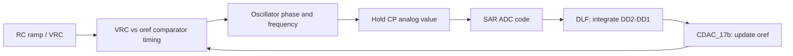
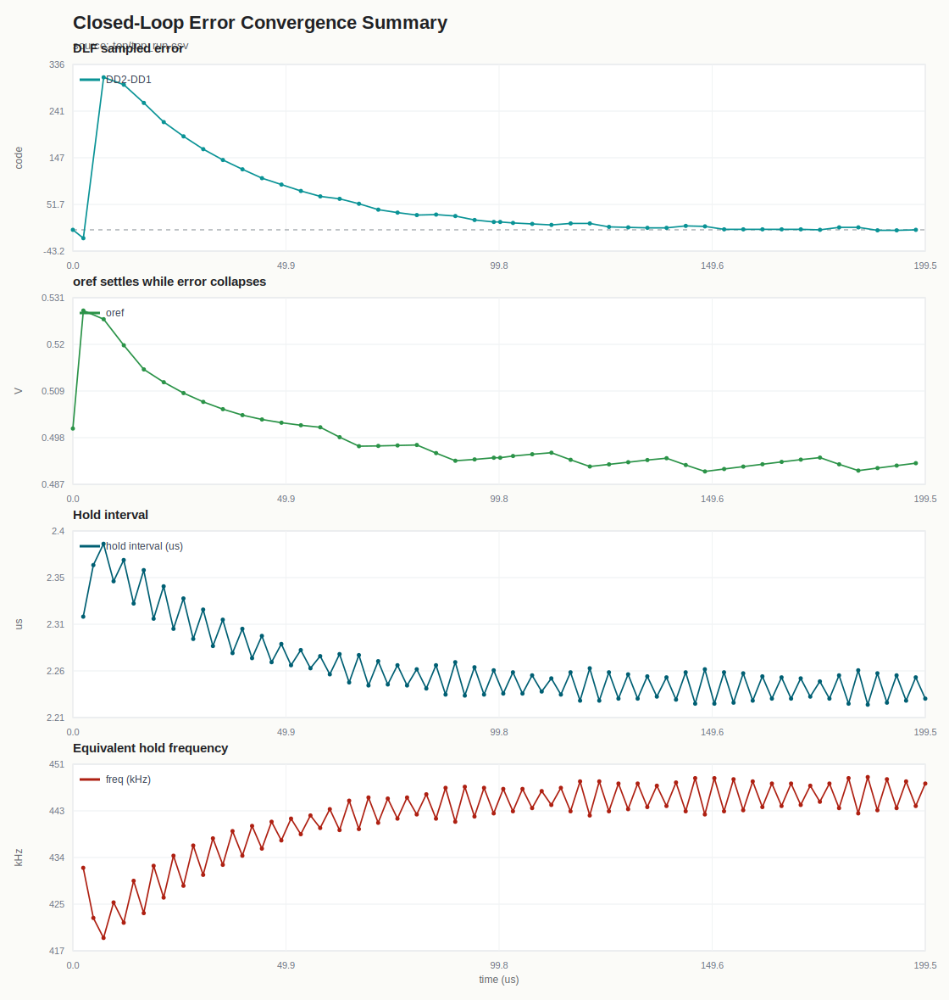
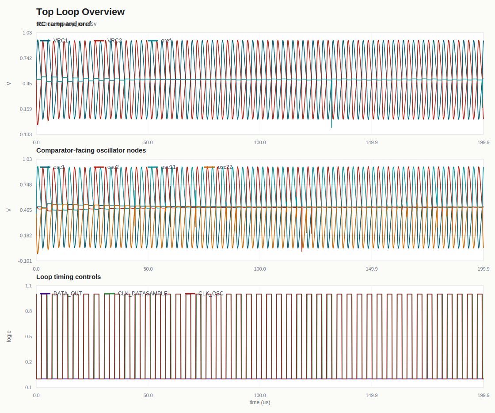
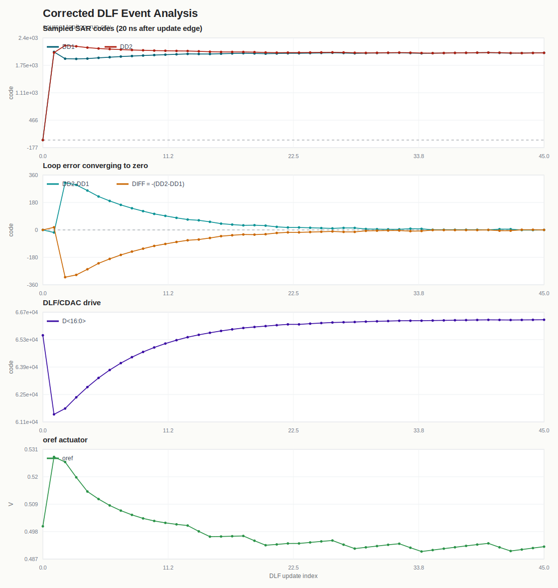
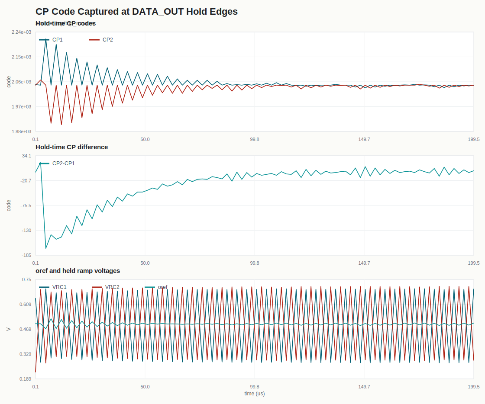
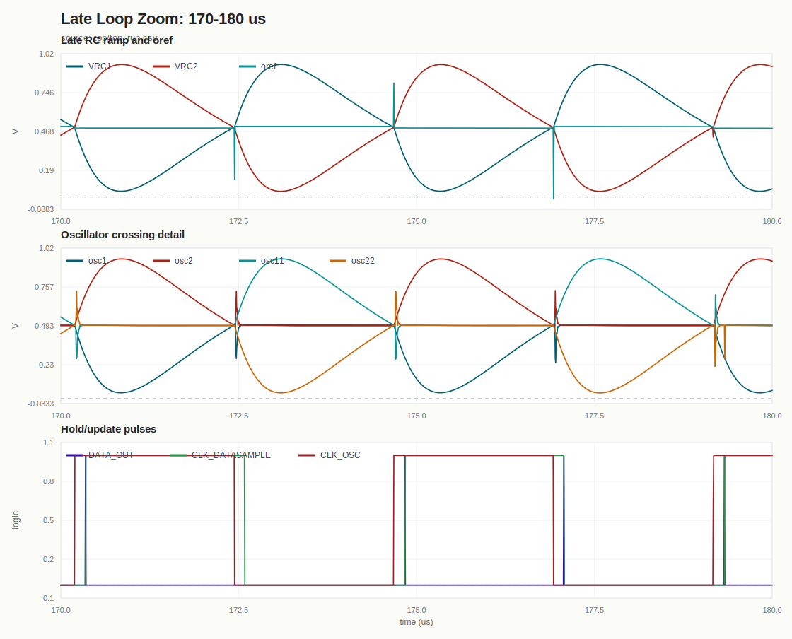

# Top Closed-Loop Operation

이 문서는 `top/RCnetlist`와 `top/top_run.csv`를 기준으로 RC oscillator 폐루프가 무엇을 맞추는지 정리한 GitHub용 노트이다.

## Core Idea

폐루프의 목표는 두 RC phase가 hold 시점에 만들어낸 SAR 코드 차이가 0이 되도록 `oref`를 조절하는 것이다.

1. RC 네트워크의 `VRC`가 시간에 따라 충전/방전된다.
2. `VRC`와 `oref`의 비교 타이밍이 oscillator phase를 결정한다.
3. SAR ADC가 hold 시점의 `CP` 아날로그 값을 코드로 변환한다.
4. DLF가 두 phase 코드 `DD2-DD1`을 적분한다.
5. DLF accumulator가 `CDAC_17b`를 구동해 `oref`를 바꾼다.
6. 바뀐 `oref`가 다시 비교 타이밍과 주파수를 바꾼다.
7. 반복 후 `DD2-DD1 -> 0`이면 두 phase가 같은 지점에서 hold되고 주파수가 lock된다.



## Block Map

| Block | Folder | Role | Current verification |
|------|------|------|------|
| RC oscillator top | `top/` | Connects RC ramp, SAR, DLF, and oref feedback | `top/top_run.csv`, `top/RCnetlist` |
| SAR ADC | `sar_test/` | Converts held CP voltage into a 12-bit code | `sar_test/20260702_sar_integration_verify.md` |
| DLF | `dlf_test/` | Integrates phase-code error and drives oref DAC code | `dlf_test/20260702_dlf_verify.md` |
| oref DAC | `cdac17_test/` | 17-bit CDAC that converts DLF accumulator to `oref` | `cdac17_test/20260702_cdac17_verify.md` |
| SAR CDAC | `cdac_test/` | 12-bit charge redistribution DAC inside SAR | `cdac_test/20260701_cdac_12b_verify.md` |
| StrongARM comparator | `strongarm_test/` | SAR bit decision comparator | `strongarm_test/20260701_sar_comparator_verify.md` |
| Temperature / bias references | `tempsensor/` | Supporting reference and temperature-related notes | `tempsensor/docs/` |

## Top Waveform Evidence

GitHub can show SVGs inline, and each thumbnail below is clickable. The SVGs are generated from `top/top_run.csv` with:

```powershell
python scripts/generate_top_graphs.py
```

The analysis uses two different sampling points:

- `DATA_OUT` rising edge: CP hold code is valid at the edge, then resets shortly after.
- `CLK_DATASAMPLE` rising edge + 20 ns: DLF buses and `oref` are sampled after digital/analog settling.

### Lock Summary

[](img/top_lock_summary.svg)

This is the main result plot. It shows the DLF sampled error collapsing from hundreds of codes to a few codes and finally reaching zero.

### Loop Overview

[](img/top_loop_overview.svg)

### DLF Convergence

[](img/top_dlf_convergence.svg)

The important trace is the sampled code error. The run starts with a large startup transient, then the sampled `DD2-DD1` term settles around zero-code error in the late part of the simulation. This plot is sampled 20 ns after `CLK_DATASAMPLE` edges.

### CP Hold Codes

[](img/top_cp_hold_codes.svg)

`DATA_OUT` is the CP hold/capture event. This plot reconstructs the `CP1<11:0>` and `CP2<11:0>` buses at those edges.

### Late Loop Timing Zoom

[](img/top_late_loop_zoom.svg)

The late-window zoom is useful for checking how the changed `oref` shifts RC comparison timing once the loop is near balance.

## Interpretation

- The intended lock condition is not a fixed absolute `oref`; it is the condition where the hold-time CP code difference becomes zero.
- `oref` is the loop actuator. If `DD2-DD1` is positive or negative, the DLF changes the CDAC_17b code and moves `oref`.
- Moving `oref` changes the crossing time between `VRC` and `oref`, which changes oscillator period/phase.
- Because the next hold samples a different analog CP value, the SAR code changes and the DLF sees a smaller or opposite error.
- In the current top run, the late samples show `DD2-DD1` repeatedly reaching 0 or a few LSB around 0, which is the expected closed-loop behavior.

## Notes For GitHub

- Static graph thumbnails are the safest GitHub option. Markdown can link images, so clicking a thumbnail opens the full SVG.
- Fully interactive graphs with hover/zoom need HTML/JavaScript. GitHub will store those files, but it will not execute the JavaScript inside README. If interactive plots become important, use GitHub Pages or attach exported HTML files as downloadable artifacts.
- Keep `top/top_run.csv` as the source of truth and regenerate `docs/img/*.svg` whenever the top simulation is rerun.
- `docs/top_event_analysis.csv` contains the extracted event table used for the event-based plots.
