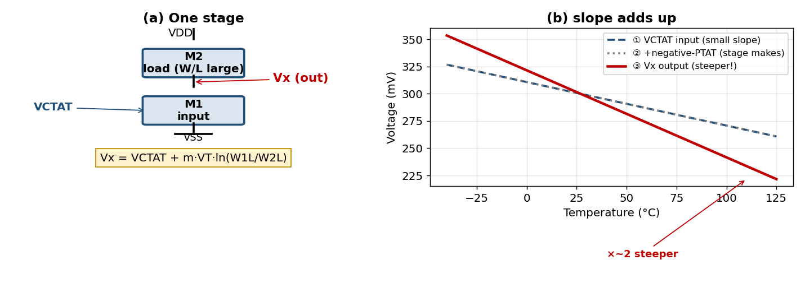
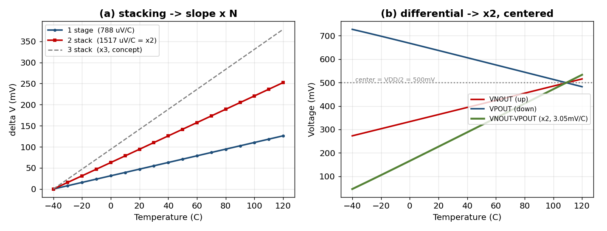

# TC-Amplifier 온도센서 — 동작 원리 (한눈에 이해하기)

> 1V · 28nm FD-SOI · 나노와트(nW) 온도센서
> 참조: Jeong et al., JSSC, "A Temperature Coefficient Amplifier based Temperature Sensor (41fJ·K²)"

---

## 0. 한 줄 요약

> **온도에 따라 아주 조금만 변하는 신호를, 트랜지스터로 "증폭"해서 크고 깨끗한 온도 신호로 만들고, 디지털 온도값으로 바꾸는 센서.** 1V에서 나노와트만 쓴다.

---

## 1. 무엇이 문제였나

온도 신호(기울기, gradient)는 **1~2 mV/°C로 아주 작은데**, 그 위에 **수백 mV짜리 큰 DC offset**이 얹혀 있다.

- ADC(아날로그→디지털 변환기)의 측정 범위 대부분이 **쓸데없는 offset에 낭비**된다.
- 작은 신호를 그냥 증폭하면 offset까지 같이 커져서 회로가 **포화(rail에 붙음)** 된다.

```
  전압
   ▲           ┌──────── 큰 offset (수백 mV, 쓸모없음)
   │  ░░░░░░░░░░│
   │           └─ 그 위 얇은 온도신호 (1~2mV/°C) ← 이걸 재고 싶다
   └─────────────────────► 온도
```

> **비유:** 두꺼운 책상(offset) 위에 얇은 종이 한 장(신호)을 올려두고 종이 두께를 재려는데, 자가 바닥부터 재느라 종이를 못 본다.

---

## 2. 핵심 아이디어 — TC Amplifier (온도계수 증폭기)

서로 반대로 변하는 두 신호를 만든다:
- **CTAT**: 온도 ↑ → 전압 ↓
- **PTAT**: 온도 ↑ → 전압 ↑

**둘을 빼면:**

| | offset | 기울기(온도신호) |
|---|---|---|
| CTAT − PTAT | **서로 상쇄 → 작아짐** | **같은 방향으로 합쳐짐 → 커짐** |

> 책상(offset)은 치우고, 종이(신호)는 두껍게 만드는 셈.

여기에 **여러 단을 쌓으면(stacking)** 기울기가 **N배**로 더 커진다.
→ **offset은 작게, 온도 신호만 크게.**

---

## 3. 회로는 어떻게 동작하나 (한 스테이지)

트랜지스터 **2개**로 한 단을 만든다 — 둘 다 **서브문턱**(전류가 나노암페어로 아주 작은 영역)에서 동작:

```
        VDD
         │
      ┌──┴──┐  M2 : 부하 (diode)
      └──┬──┘
        Vx  ──────► 출력
      ┌──┴──┐  M1 : 입력 (gate ← VCTAT)
      └──┬──┘
        VSS
```

**동작을 3단계로:**
1. **①** 입력 게이트에 **CTAT 전압**을 넣는다 (온도에 따라 살짝 기우는 전압).
2. **②** 부하 M2를 입력보다 **크게(W/L↑)** 만들면, 스테이지가 스스로 **"음의 PTAT"** 기울기를 하나 더 만든다.
3. **③** 출력 Vx = ① + ② → 두 기울기가 **합쳐져 더 가파른**(=더 민감한) 온도신호가 된다.


*[그림 3] (a) 한 스테이지 회로  (b) 입력의 작은 기울기①에 스테이지가 만든 기울기②가 더해져 출력③이 더 가팔라진다.*

$$V_x = V_{CTAT} + m\,V_T\,\ln\!\left(\frac{W_1/L_1}{W_2/L_2}\right)$$

- **앞 항** = CTAT 그대로 전달
- **뒤 항** = 부하(M2)를 크게 만들면 생기는 **"음의 PTAT"** → 온도 기울기를 추가로 만들어 줌

**핵심 장점:** M1과 M2를 **같은 종류 · 같은 back-gate**로 쓰면 **문턱전압(Vth)이 수식에서 상쇄**된다.
→ 공정이 흔들려도 출력이 안정 → **1점(1-point) 보정만으로 충분**.

---

## 4. 신호를 키우기 — 적층 + 차동

1. **적층 (N단)**: 같은 단을 N개 쌓으면 기울기 **× N**
2. **차동 (NMOS + PMOS)**:
   - NMOS 가지 → VDD 기준, 온도 ↑ → 출력 **↑** (VNOUT)
   - PMOS 가지 → GND 기준, 온도 ↑ → 출력 **↓** (VPOUT)
   - 두 출력을 빼면 기울기 **또 × 2**, 그리고 출력 중심이 **공급의 정중앙(VDD/2)** 에 자리 → ADC가 받기 딱 좋다.

```
 VNOUT  ╱   (온도↑ → ↑)
        ╱
 ──────╳────────  중심 = VDD/2
        ╲
 VPOUT   ╲  (온도↑ → ↓)
     차동 = VNOUT − VPOUT  → 기울기 2배
```


*[그림 4] (a) 적층: 단을 쌓을수록 기울기가 ×N (1단 788 → 2단 1517 µV/°C).  (b) 차동: VNOUT(↑)−VPOUT(↓) → 기울기 ×2 (3.05 mV/°C), 중심은 VDD/2.*

> **정리:** 처음 1~2 mV/°C이던 신호가 **적층(×N) × 차동(×2)** 으로 **3.05 mV/°C**까지 커지고, 출력 중심도 ADC에 맞게 VDD/2로 정렬된다.

---

## 5. 왜 나노와트(nW)인가

모든 트랜지스터가 **서브문턱(전류 nA급)** 에서 동작 → 전체 전력이 **나노와트**.
→ 배터리로 오래 버텨야 하는 **IoT·센서노드**에 이상적.

---

## 6. 우리 시뮬레이션 결과 (1V · 28FDS) — 동작 확인 ✅

| 항목 | 결과 | 의미 |
|---|---|---|
| **입력 비교** | 평탄 입력 **80 µV/°C** → CTAT 입력 **788 µV/°C** | 입력만 바꿔도 신호 **약 10배** |
| **선형성** | 비선형 13 °C → **0.2 °C** | 신호가 커지며 **직선화** |
| **단일 스테이지** | 788 µV/°C, 전류 **12 nA (12 nW)** | 서브문턱 nW 동작 |
| **2단 적층** | **1517 µV/°C** | 기울기 정확히 **× 2** |
| **차동 (N+P)** | **3.05 mV/°C**, 출력 중심 **0.5 V (=VDD/2)** | × 2 + 중앙 정렬 |
| **온도 범위** | −40 ~ 125 °C 전 구간 서브문턱 유지 | 전 범위 정상 동작 |

> 즉, **논문의 핵심 동작을 우리 1V 공정에서 그대로 재현**했다.

---

## 7. 디지털로 — 온도값 읽기

크고 직선적인 차동 신호(3.05 mV/°C)를 **12비트 SAR ADC**가 코드로 변환:

- **1 °C 당 약 20 코드** (≈ 0.05 °C 분해능)
- 출력이 **직선**이라 복잡한 곡선보정(고차 다항식)이 **필요 없음** → 디지털 단순

```
  CTAT 입력 ─► TC-Amplifier ─► 큰 선형 차동 ─► SAR ADC ─► 디지털 온도값
   (작은 신호)   (offset 제거+증폭)  (3mV/°C)      (12bit)
```

---

## 8. 한 장 요약

| 무엇 | 어떻게 | 결과 |
|---|---|---|
| 작은 온도신호 + 큰 offset | CTAT−PTAT로 **offset 상쇄 + 기울기 합산** | 신호만 키움 |
| 더 키우기 | **N단 적층 × 차동** | 3.05 mV/°C |
| 저전력 | 전 소자 **서브문턱** | ~12 nW |
| 정확도 | **Vth 상쇄** 구조 | 1점 보정으로 충분 |
| 읽기 | 직선 출력 → **12b SAR** | ~0.05 °C, 곡선보정 불필요 |

---

## 9. 한 문장 결론

> **작고 묻혀 있던 온도 신호를, 트랜지스터 적층·차동으로 offset은 지우고 기울기만 키워서, 1V·나노와트로 깨끗하고 직선적인 "온도 → 디지털" 변환을 실현한 센서.**
